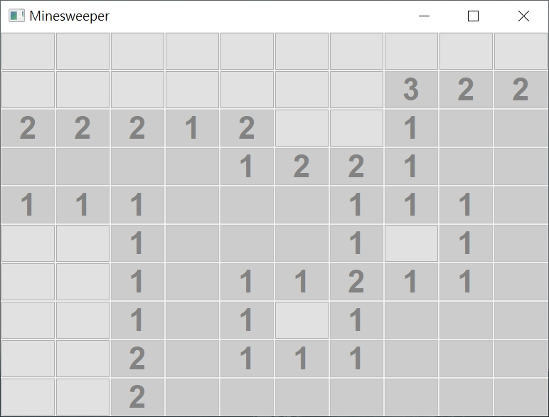

# Minesweeper

Implement Minesweeper using C++ and wxWidgets. This program is based on and modified from [this video](https://www.youtube.com/watch?v=FOIbK4bJKS8).

If you want to compile this program in a non-Windows environment, you should simply remove `SetProcessDPIAware()` in `cApp.cpp`.

## Requirement

- wxWidgets

## License
Copyright (C) 2022 Chiahong Hong. <https://github.com/ChiahongHong/>

This program is free software: you can redistribute it and/or modify
it under the terms of the GNU General Public License as published by
the Free Software Foundation, either version 3 of the License, or
(at your option) any later version.

This program is distributed in the hope that it will be useful,
but WITHOUT ANY WARRANTY; without even the implied warranty of
MERCHANTABILITY or FITNESS FOR A PARTICULAR PURPOSE.  See the
GNU General Public License for more details.

You should have received a copy of the GNU General Public License
along with this program.  If not, see <https://www.gnu.org/licenses/>.
